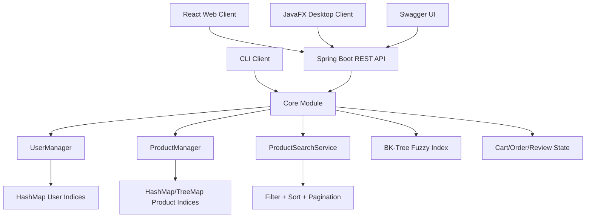

# 🛒 Vendilo — Multi-Client Marketplace Platform (Java + Spring Boot + React)


**Vendilo** is a resume-ready **multi-client marketplace system** evolved from an Advanced Programming / Data Structures & Algorithms semester project.  
It combines a modular Java core with multiple user interfaces: **CLI**, **Spring Boot REST API**, **React/Vite Web Demo**, and **JavaFX Desktop Demo**.

The project demonstrates practical software engineering and algorithmic design:  
**hash-based indexing**, **TreeMap range candidates**, **BK-Tree fuzzy search**, **pagination**, **JWT authentication**, **role-based workflows**, **cart/order flow**, **customer reviews**, and a polished responsive UI.

> ⚠️ Educational project. Not intended as a production marketplace without further hardening, persistence, and security review.

---

## ✨ Highlights

- **Multi-module Gradle architecture**
  - `core` for models, managers, services, indexing, fuzzy search, and tests
  - `api-spring` for REST API, Swagger/OpenAPI, JWT, CORS, and API DTOs
  - `web-react` for React + Vite + TypeScript demo
  - `desktop-javafx` for desktop API-consuming demo
  - `cli` for the original console interface

- **Advanced product search**
  - keyword search
  - category/type filter
  - price range filter
  - rating filter
  - sorting and pagination
  - **BK-Tree fuzzy search** toggle

- **Data-structure upgrades**
  - `HashMap` indices for O(1) average lookup/uniqueness checks
  - `TreeMap` price index for range-based candidate selection
  - BK-Tree for edit-distance fuzzy search

- **REST API + Swagger**
  - OpenAPI documentation available at `/swagger-ui`
  - endpoints for auth, products, reviews, cart, orders, and manager actions

- **JWT authentication**
  - login/register endpoints
  - bearer token attached from React via axios interceptor
  - protected cart/order/review operations

- **Reviews system**
  - product review listing
  - review creation
  - average rating and review count reflected in product list/details
  - seeded sample reviews

- **React/Vite web demo**
  - Sign in / Sign up split
  - product listing and filtering
  - product details
  - cart and checkout
  - review submission
  - theme switcher: `Dark`, `Light`, `Scheduled`
  - polished responsive marketplace UI

- **Manager hierarchy rule**
  - managers cannot manage/block their ancestors or invalid hierarchy targets

- **Testing ready**
  - JUnit tests for core user and product-search behavior

---

## 📦 Repository layout

```txt
Vendilo/
  core/
    src/main/java/ir/ac/kntu/
      model/              # User/Product/Cart/Order domain models
      search/             # ProductQuery + ProductSearchService
      util/               # SampleData, BKTree, PasswordHasher, helpers
      ProductManager.java # product storage + product indices
      UserManager.java    # user storage + user indices
    src/test/java/        # JUnit tests

  api-spring/
    src/main/java/com/saghar/marketplace/api/
      controller/         # Auth/Product/Review/Cart/Order/Manager controllers
      dto/                # request/response DTO records
      security/           # JWT service + auth filter
      config/             # Security/CORS config
      service/            # AppState + demo in-memory state
      exception/          # unified API error handling
    src/main/resources/
      application.yml

  web-react/
    src/
      components/         # layout, theme switcher, shared UI components
      pages/              # Login/Register/Products/Details/Cart
      lib/                # axios client, auth, theme utilities
      types/              # API TypeScript types
    package.json
    vite.config.ts

  desktop-javafx/
    src/main/java/com/saghar/marketplace/desktop/
      DesktopApp.java     # JavaFX REST-consuming demo

  cli/
    src/main/java/ir/ac/kntu/
      Main.java
      PageManager.java
      pages/              # CLI pages

  docs/
    demo.gif
    reviews.md
    sample-accounts.md

  settings.gradle
  build.gradle
  README.md
```

---

## 🧠 Design

### 1) Modular core shared by all clients

The project keeps core marketplace logic separate from UI concerns.  
The same product/user/search logic can be consumed by:

- CLI
- Spring REST API
- JavaFX desktop client
- React web client through the API

This makes the system easier to test, extend, and present as a real multi-client application.

---

### 2) Fast user lookup and uniqueness checks

`UserManager` maintains fast indices such as:

- customers by email
- customers by phone
- sellers by store code
- sellers by phone/store name
- supporters/managers by username

This avoids repeated O(n) scans for common login and validation paths.

---

### 3) Product indexing and search pipeline

`ProductManager` and `ProductSearchService` use a staged pipeline:

1. **Candidate selection** via indices
2. **Filter chain** for type/price/rating/keyword
3. **Sorting** by price/name/rating
4. **Pagination** for UI-friendly results

Implemented indices include:

- exact name index
- product type index
- `TreeMap` price buckets
- BK-Tree fuzzy-name index

---

### 4) BK-Tree fuzzy search

The project includes a BK-Tree implementation for approximate name matching with edit distance.  
This is useful for typo-tolerant searches such as:

```txt
clen cod  →  Clean Code
iphne     →  iPhone 15
```

---

### 5) JWT-secured REST API

The Spring Boot API exposes public product browsing and protected user actions:

- public: product list/details/reviews
- protected: cart, checkout, review creation, manager actions

React stores the JWT client-side and attaches it through an axios interceptor.

---

### 6) Theme modes in the frontend

The React demo supports:

- `Dark`
- `Light`
- `Scheduled`

Scheduled mode switches automatically based on local time.

---

## 🧭 System flow



---

## 🔌 REST API overview

Swagger UI:

```txt
http://localhost:8080/swagger-ui
```

OpenAPI docs:

```txt
http://localhost:8080/api-docs
```

| Controller | Endpoint | Purpose |
|---|---|---|
| Auth | `POST /api/auth/login` | login and get JWT |
| Auth | `POST /api/auth/register` | create user |
| Products | `GET /api/products` | list/search/filter/sort/paginate products |
| Products | `GET /api/products/{id}` | product details |
| Reviews | `GET /api/products/{id}/reviews` | list product reviews |
| Reviews | `POST /api/products/{id}/reviews` | create review |
| Cart | `GET /api/cart` | get current user's cart |
| Cart | `POST /api/cart/items` | add item |
| Cart | `DELETE /api/cart/items/{productId}` | remove item |
| Orders | `POST /api/orders/checkout` | checkout |
| Manager | `POST /api/manager/block` | manager block action |

---

## 🔎 Product search examples

```txt
GET /api/products?page=0&size=20
GET /api/products?q=java
GET /api/products?type=Book
GET /api/products?minPrice=100000&maxPrice=500000
GET /api/products?q=clen%20cod&fuzzy=true
GET /api/products?sort=PRICE_DESC
```

Supported query params:

| Param | Example | Description |
|---|---|---|
| `q` | `java` | keyword search |
| `type` | `Book` | product type/category |
| `minPrice` | `100000` | lower price bound |
| `maxPrice` | `500000` | upper price bound |
| `minRating` | `4` | minimum average rating |
| `fuzzy` | `true` | enable BK-Tree fuzzy search |
| `sort` | `PRICE_ASC` | sorting mode |
| `page` | `0` | page index |
| `size` | `20` | page size |

---

## 👤 Sample accounts

Use these accounts to test login, cart, checkout, and reviews.

### Customer

```txt
Email: ali@mail.com
Password: Abcd@1234+
```

```txt
Email: sara@mail.com
Password: Qwer@5678
```

```txt
Email: mina@mail.com
Password: Zxcv#9012
```

### Seller

```txt
Store code: ST1001
Password: Zxcv#9012
```

### Supporter

```txt
Username: rezakar
Password: Supp*3344
```

### Manager

```txt
Username: mina_admin
Password: Admin@2025
```

---

## 🚀 Build & Run

### Requirements

- Java 17+
- Gradle wrapper included (`gradlew` / `gradlew.bat`)
- Node.js LTS + npm for React

---

### 1) Run the API

From the project root:

```powershell
.\gradlew :api-spring:bootRun --no-daemon --console=plain
```

Expected success message:

```txt
Tomcat started on port 8080
Started MarketplaceApiApplication
```

The terminal staying at `EXECUTING` is normal because the server is running.

---

### 2) Run the React web demo

Open a second terminal:

```powershell
cd web-react
npm install
npm run dev
```

Then open:

```txt
http://localhost:5173
```

If PowerShell blocks npm scripts, use:

```powershell
npm.cmd install
npm.cmd run dev
```

or set the policy for the current user:

```powershell
Set-ExecutionPolicy -Scope CurrentUser -ExecutionPolicy RemoteSigned
```

---

### 3) Run the CLI

```powershell
.\gradlew :cli:run
```

---

### 4) Run the JavaFX desktop demo

Start the API first, then:

```powershell
.\gradlew :desktop-javafx:run
```

---

## 🧪 Tests

Run all tests:

```powershell
.\gradlew test
```

Run core tests only:

```powershell
.\gradlew :core:test
```

Tests cover:

- customer registration and login
- uniqueness rules
- manager hierarchy rule
- product search pipeline
- fuzzy search behavior

---

## 🛠 Troubleshooting

### `npm.ps1 cannot be loaded`

Use:

```powershell
npm.cmd install
npm.cmd run dev
```

or:

```powershell
Set-ExecutionPolicy -Scope CurrentUser -ExecutionPolicy RemoteSigned
```

---

### Gradle stays on `EXECUTING`

If the output says Spring Boot started successfully, this is normal.  
The server is running and waiting for HTTP requests.

---

### Gradle is slow on `desktop-javafx`

For API-only testing, temporarily edit `settings.gradle`:

```gradle
include 'core', 'api-spring'
```

Then run:

```powershell
.\gradlew :api-spring:bootRun --no-daemon --console=plain
```

Restore `desktop-javafx` later if needed.

---

### React shows zero products

Check that the API has loaded seed data and that this endpoint returns products:

```txt
http://localhost:8080/api/products
```

If Swagger works but product list is empty, check backend logs for `SampleData` warnings.

---

## 🗺 Roadmap

- [ ] Add persistent database storage (SQLite/PostgreSQL)
- [ ] Add Flyway migrations
- [ ] Add admin dashboard charts
- [ ] Add seller product-management UI
- [ ] Add profile page and order history
- [ ] Add refresh tokens
- [ ] Add Docker Compose for API + web
- [ ] Add GitHub Actions CI for core/API/web builds
- [ ] Add benchmark report for brute-force search vs BK-Tree search

---

## 📄 License

MIT License.

---

## 👩‍💻 Author

**Saghar Ramezani** — Computer Engineering  
Advanced Programming / Data Structures & Algorithms project
